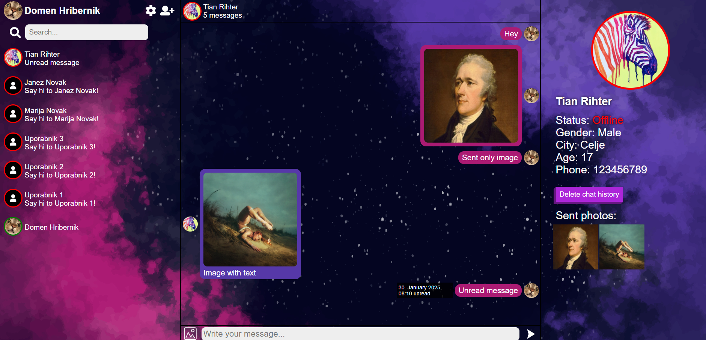

# PHP Messenger

## Project Overview

This project is a simple PHP-based messaging application that enables users to send and receive messages in real-time (when hosted). It was developed as part of a group project in 2020 and represents one of my earliest projects into web development. The application includes features such as message status tracking (read/unread), image uploads, and a user-friendly interface, with a custom CSS style.

For more detailed documentation, please refer to the NPP.docx file included in this repository.

## Installation Instructions

1. Clone the repository:
    ```bash
    git clone https://github.com/yourusername/PHP-messenger.git
    ```
2. Navigate to the project directory:
    ```bash
    cd PHP-messenger
    ```
3. Start the XAMPP control panel and ensure that Apache and MySQL are running.
4. Move the project directory to the `htdocs` folder of your XAMPP installation:
    ```bash
    mv PHP-messenger /path/to/xampp/htdocs/
    ```
5. Open phpMyAdmin by navigating to `http://localhost/phpmyadmin` in your web browser.
6. Create a new database named `project` by clicking on the "New" button in the left sidebar, entering `project` as the database name, and clicking "Create".
7. Import the `project.sql` script to set up the database structure and add initial data:
    - Click on the `project` database in the left sidebar.
    - Go to the "Import" tab.
    - Click "Choose File" and select the `project.sql` file from the project directory.
    - Click "Go" to import the script.   
8. Open your web browser and navigate to `http://localhost/PHP-messenger/Project/login.php`.
9. You can login with existing profiles:
- Domen Hribernik: `email: d@d` `password: domen123`
- Tian Rihter: `email: t@t` `password: tiantian`

## Key Features

- **User Registration and Login**: Users can create an account by providing their email, name, password, and other details. The login system ensures secure access to the application.
- **Real-Time Messaging**: Users can send and receive text messages, images, or a combination of both. Messages are stored in a database and displayed in a chat interface.
- **Friend Management**: Users can add or remove friends from their contact list. The application also allows users to filter their friends by name.
- **Profile Customization**: Users can update their profile information, including their profile picture, password, and personal details.
- **Message Status Tracking**: Messages are marked as "read" or "unread," and users can view the timestamp of each message.
- **Responsive Design**: The application adapts to different screen sizes, ensuring a seamless experience on both desktop and mobile devices.


## Application Workflow

1. **Registration**: Users register by providing their details, including email, name, password, and other personal information. The system ensures that email addresses are unique and passwords meet security requirements.
2. **Login**: After registration, users log in using their email and password. Upon successful login, they are redirected to the main dashboard.
3. **Main Dashboard**: The dashboard displays a list of friends, a chat interface for messaging, and a section for viewing friend information.
4. **Messaging**: Users can send and receive messages in real-time. Messages can include text, images, or both. The chat interface displays messages in a threaded format, with sent messages aligned to the right and received messages aligned to the left.
5. **Friend Management**: Users can add or remove friends from their contact list. The application also provides a search feature to filter friends by name.
6. **Profile Settings**: Users can update their profile information, change their password, or delete their account. Profile pictures are stored in a dedicated folder, and old pictures are deleted when a new one is uploaded.
7. **Logout**: Users can log out of the application, which clears their session and redirects them to the login page.


## Application Screenshot



This image showcases the user interface of the PHP Messenger application, highlighting the chat interface, friend list, and profile overview. After hovering a message, a tooltip shows the status of the message.

## Database Structure

The application uses a MySQL database with the following tables:

- **`users`**: Stores user information, including email, name, password, profile picture, and other personal details.
- **`users_chat`**: Stores messages between users, including the sender, receiver, message content, message status, and timestamp.
- **`users_friends`**: Manages friend relationships between users. Each entry represents a friendship between two users.


## Technologies Used

- **Frontend**: HTML, CSS, JavaScript
- **Backend**: PHP
- **Database**: MySQL
- **Version Control**: Git
- **Hosting**: Localhost (XAMPP)


## Challenges and Learnings

During the development of this project, several challenges were encountered and overcome:
- **Real-Time Messaging**: Implementing real-time messaging without refreshing the page was a significant challenge. While PHP alone cannot achieve true real-time communication, the application simulates real-time behavior by refreshing the chat interface periodically.
- **Image Handling**: Managing user-uploaded images required careful handling of file storage, validation, and deletion. The application ensures that images are stored securely and deleted when no longer needed.
- **Database Design**: Designing an efficient a key learning experience. The use of foreign keys and relational tables helped maintain data integrity.

## Future Improvements

If I were to revisit this project, I would implement several key improvements to enhance functionality, security, and performance:

1. **Real-Time Messaging with AJAX**  
   Replace PHP-based messaging with JavaScript and AJAX to enable true real-time communication. This would eliminate the need for page refreshes and provide a smoother, more responsive user experience.
2. **Password Security**  
   Implement password hashing using `password_hash()` and `password_verify()` in PHP to securely store passwords in the database. Currently, passwords are stored in plain text, which poses a significant security risk.
3. **Image Storage Optimization**  
   Store profile images directly in the database as binary data (BLOBs) instead of saving them on the client side. This would improve load times, simplify image management, and reduce the risk of file system clutter.
4. **Code Refactoring and Modernization**  
   Refactor the codebase to follow modern best practices, such as using prepared statements to prevent SQL injection, adopting a modular structure, and improving error handling.

These improvements were not implemented initially due to time constraints and my limited experience at the time of development. However, they represent important steps toward making the application more secure, scalable, and user-friendly.